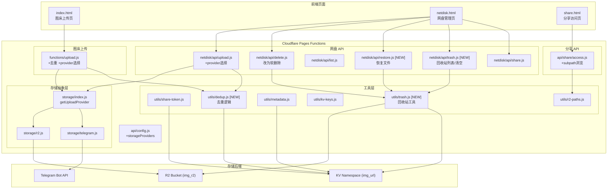

## 产品概述

对现有 Cloudflare Pages 项目（Telegraph-Image）的网盘和图床功能进行增强改造，覆盖四个核心目标：回收站、上传去重、文件夹分享 UI 完善、存储目标选择。同时优化两个页面的交互逻辑。

## 核心功能

- **网盘回收站**：删除文件/文件夹时改为软删除（移到 R2 `trash/` 前缀下），支持查看回收站列表、恢复文件到原路径、彻底删除、清空回收站
- **上传去重**：上传文件时计算 SHA-256 内容哈希，在 KV 中查找已有相同哈希记录，命中则直接返回已有链接不重复存储
- **分享文件夹 UI 完善**：后端已支持文件夹分享（列表+ZIP+单文件下载），完善前端 share.html 的文件夹浏览体验，支持文件夹内层级导航
- **存储目标选择**：图床和网盘上传时，前端可选择存储到 R2 或 Telegram；后端 `/upload` 和 `/netdisk/api/upload` 支持按请求覆盖 `STORAGE_PROVIDER`
- **页面逻辑优化**：网盘增加回收站入口和存储目标选择器；图床增加存储目标选择器；两个页面统一上传交互反馈

## Tech Stack

- 运行时：Cloudflare Pages Functions（Workers runtime）
- 存储：R2（`img_r2` bucket）、KV（`img_url` namespace）
- 前端：原生 HTML + CSS + Vanilla JS（无框架），已有 `assets/theme.css` 设计系统
- 依赖库：`fflate`（ZIP 打包，已在 share/download 中使用）
- Telegram Bot API（图床存储后端之一）

## Implementation Approach

### 1. 网盘回收站（软删除 + 恢复 + 清空）

**策略**：利用 R2 的路径前缀能力，删除时不物理删除，而是将对象移动到 `trash/` 前缀下。

- **删除**：`functions/netdisk/api/delete.js` 改为软删除——文件通过 copy+delete 移到 `trash/{原路径}`；文件夹递归遍历子对象逐个移到 `trash/{原路径}`，保留目录标记
- **恢复**：新增 `functions/netdisk/api/restore.js`，将 `trash/{path}` 下的对象移回原路径
- **回收站列表**：新增 `functions/netdisk/api/trash.js`（GET 列出 `trash/` 前缀下的对象），复用 `listAllObjects` + `parseListResult`
- **清空**：同一 `trash.js` 支持 DELETE 方法批量物理删除 `trash/` 前缀下所有对象
- **回收站元数据**：在 KV `trash:{原key}` 存储原始路径和时间戳，用于恢复和显示

**性能考量**：R2 无原生 move，软删除=copy+delete，大文件夹会消耗多次 R2 操作。限制单次回收站操作上限 10000 个对象（与现有 delete.js 一致），超限返回提示。回收站列表复用 `listAllObjects` 分页。

### 2. 上传去重（SHA-256 内容哈希）

**策略**：上传前计算文件 SHA-256，在 KV 中以 `dedup:{hash}` 为 key 查找已有记录。

- **图床上传**（`functions/upload.js`）：在 `provider.upload` 之前，先 `await crypto.subtle.digest('SHA-256', arrayBuffer)` 计算哈希，查 KV `dedup:{hash}`。命中则跳过实际上传，直接用已有 fileId 构造响应。未命中则正常上传，上传成功后写 KV `dedup:{hash}` -> `{ fileId, fileName, fileSize, provider, createdAt }`
- **网盘上传**（`functions/netdisk/api/upload.js`）：同样计算哈希，但网盘有目录路径语义，去重逻辑为：如果 `dedup:{hash}` 命中且目标路径相同则跳过；如果路径不同但内容相同，仍上传（因为网盘需要按路径访问）。网盘去重仅在同路径覆盖场景生效
- **KV 命名空间**：`dedup:` 前缀已被 `isInternalKey` 的 `/^[a-z][a-z0-9-]*:/i` 正则匹配，不会出现在图床管理列表中

**性能考量**：SHA-256 计算需要完整读取文件到内存（`arrayBuffer()`），Workers 内存 128MB 限制下大文件可能 OOM。对 >50MB 的文件跳过去重直接上传（降级策略），返回结果中标记 `dedupSkipped: true`。

### 3. 存储目标选择（R2 / Telegram）

**策略**：后端支持按请求覆盖 provider，前端提供选择器 UI。

- **图床**（`functions/upload.js`）：`pickProvider` 增加 `requestProvider` 参数——从 FormData 中读取 `provider` 字段（值为 `r2` 或 `telegram`），有则覆盖 `env.STORAGE_PROVIDER`。大文件自动转 R2 逻辑保留（Telegram 20MB 限制）
- **网盘**（`functions/netdisk/api/upload.js`）：增加 `provider` query 参数。选择 Telegram 时走 `telegramProvider.upload`，文件存到 Telegram 并在 KV 记录映射；选择 R2（默认）走原有 `env.img_r2.put`。网盘选择 Telegram 时文件不在 R2 路径下，需在 KV `ndfile:{路径}` 存储元数据（fileId, provider, size），下载时根据 provider 路由
- **前端**：`index.html` 和 `netdisk.html` 各加存储目标选择器（下拉或按钮组），`/api/config` 返回 `storageProviders` 可用列表（根据 env 配置判断 Telegram/R2 是否可用）

**约束**：Telegram Bot API 单文件上限 20MB，前端选择 Telegram 但文件 >20MB 时返回明确错误提示。

### 4. 分享文件夹 UI 完善

后端 `functions/api/share/access.js` 已完整支持文件夹分享（列表、单文件下载、ZIP 下载）。前端 `share.html` 的 `renderShare` 已实现文件夹列表展示和 ZIP 下载。

**需完善的点**：

- 分享文件夹支持子目录层级浏览（当前 `access.js` 的 `listAllObjects` 是递归列出全部，`share.html` 是扁平展示。改为按相对路径分组，支持点击进入子目录）
- `access.js` GET 请求增加 `subpath` 参数，用于浏览文件夹内的子目录（list 时 prefix = `meta.path + subpath`，delimiter = `/`）
- `share.html` 增加面包屑导航，支持点击返回上级目录
- 下载单文件时 `download` 参数改为完整相对路径（当前只支持一级文件名）

### 5. 页面逻辑优化

- **netdisk.html**：工具栏增加"回收站"按钮，点击切换到回收站视图；增加存储目标选择器；删除操作提示文案改为"移到回收站"
- **index.html**：上传区域增加存储目标选择器；上传结果增加去重标记（如果命中去重，显示"已存在"徽标）

## Implementation Notes

### 回收站路径设计

- 回收站对象 key 格式：`trash/{原完整路径}`，如 `trash/docs/report.pdf`、`trash/photos/`（目录标记）
- 恢复时从 `trash/` 前缀剥离即可得到原路径
- KV 元数据 key：`trash:meta:{timestamp}:{原路径}`，存储 `{ originalPath, deletedAt, type, size }`，用于回收站列表展示和批量恢复
- 清空回收站：先 `list(trash/)` 递归列出所有 key 批量删除，再清理 KV 中 `trash:meta:` 前缀的 key

### 上传去重的内存安全

- Workers 内存 128MB，`await file.arrayBuffer()` 对大文件有 OOM 风险
- 策略：文件 size > 50MB 时跳过 SHA-256 计算，标记 `dedupSkipped`，直接走原上传流程
- 网盘上传同理，但因网盘文件通常较小（用户主动管理），可适当降低阈值到 30MB

### 存储选择的安全降级

- 选择 Telegram 但 `TG_Bot_Token` 未配置时，返回 400 错误提示"Telegram 未配置"
- 选择 R2 但 `img_r2` 未绑定时，返回 503（已有逻辑）
- 前端 `/api/config` 增加 `telegramAvailable` 和 `r2Available` 字段，据此控制选择器可选项

### 向后兼容

- 所有改动保持向后兼容：不传 `provider` 参数时走原有逻辑（`STORAGE_PROVIDER` 环境变量决定）
- 回收站是新增功能，不影响已有文件（仅新删除的进回收站）
- 去重是新增逻辑，已有文件不受影响（首次上传会写入 dedup 记录）
- `isInternalKey` 正则已匹配 `dedup:` 和 `trash:` 前缀，无需修改

### 日志

- 复用 `console.error` / `console.log`（项目无专用 logger）
- 去重命中时 `console.log('Dedup hit:', hash)` 便于调试
- 回收站操作失败时 `console.error` 带原始路径

## Architecture Design



## Directory Structure

```
d:/vibe coding/Telegraphimage-main/
├── functions/
│   ├── upload.js                          # [MODIFY] 图床上传：增加去重逻辑 + provider 选择
│   ├── api/
│   │   ├── config.js                      # [MODIFY] 返回 storageProviders/telegramAvailable/r2Available
│   │   └── share/
│   │       └── access.js                  # [MODIFY] 增加子目录浏览 subpath 参数
│   ├── netdisk/
│   │   ├── api/
│   │   │   ├── upload.js                  # [MODIFY] 增加 provider 选择参数
│   │   │   ├── delete.js                  # [MODIFY] 改为软删除，移到 trash/ 前缀
│   │   │   ├── trash.js                   # [NEW] 回收站列表(GET)、清空(DELETE)
│   │   │   └── restore.js                 # [NEW] 恢复文件到原路径(POST)
│   │   └── index.js                       # [MODIFY] 无需改动（返回 netdisk.html）
│   ├── storage/
│   │   └── index.js                       # [MODIFY] getUploadProvider 支持运行时覆盖
│   └── utils/
│       ├── dedup.js                       # [NEW] 去重工具：SHA-256 计算 + KV 查询/写入
│       ├── trash.js                       # [NEW] 回收站工具：软删除移动 + 恢复 + 清空 + 元数据
│       ├── kv-keys.js                     # [MODIFY] 确认 dedup:/trash: 前缀被 isInternalKey 覆盖
│       └── r2-paths.js                    # [MODIFY] 增加 trash 路径辅助函数
├── netdisk.html                           # [MODIFY] 增加回收站视图 + 存储目标选择器 + 软删除提示
├── index.html                             # [MODIFY] 增加存储目标选择器 + 去重标记
└── share.html                             # [MODIFY] 增加文件夹子目录浏览 + 面包屑
```

### 文件详细说明

**[NEW] `functions/utils/dedup.js`**

- 导出 `computeFileHash(file)` — 读取文件 arrayBuffer 计算 SHA-256，返回 hex 字符串；大文件(>50MB)返回 null
- 导出 `findDuplicate(env, hash)` — 查 KV `dedup:{hash}`，返回已有记录或 null
- 导出 `recordDedup(env, hash, metadata)` — 写 KV `dedup:{hash}` 存 `{ fileId, fileName, fileSize, provider, createdAt }`
- 导出 `DEDUP_KEY_PREFIX = 'dedup:'`

**[NEW] `functions/utils/trash.js`**

- 导出 `softDelete(env, path)` — 将 R2 对象从原路径移到 `trash/{原路径}`，在 KV `trash:meta:{timestamp}:{原路径}` 记录元数据
- 导出 `softDeleteFolder(env, dirPrefix)` — 递归移动文件夹下所有对象
- 导出 `restoreItem(env, trashKey)` — 从 `trash/` 移回原路径，清理 KV 元数据
- 导出 `listTrash(env, cursor)` — 列出回收站内容（R2 list `trash/` + KV 元数据合并）
- 导出 `emptyTrash(env)` — 物理删除 `trash/` 下所有对象 + 清理 KV

**[NEW] `functions/netdisk/api/trash.js`**

- `onRequestGet` — 列出回收站内容，返回 `{ items, cursor }`
- `onRequestDelete` — 清空回收站

**[NEW] `functions/netdisk/api/restore.js`**

- `onRequestPost` — Body `{ path: "trash/docs/file.txt" }`，恢复到原路径

**[MODIFY] `functions/upload.js`**

- `pickProvider` 增加 `requestProvider` 参数，从 FormData 读取 `provider` 字段覆盖
- 上传前调用 `computeFileHash` + `findDuplicate`，命中则跳过上传直接返回
- 上传成功后调用 `recordDedup`

**[MODIFY] `functions/netdisk/api/upload.js`**

- 支持 `?provider=r2|telegram` query 参数
- 选择 Telegram 时走 `telegramProvider.upload`，在 KV `ndfile:{路径}` 记录映射
- 选择 R2 时走原有逻辑

**[MODIFY] `functions/netdisk/api/delete.js`**

- 文件删除改为调用 `softDelete`
- 文件夹删除改为调用 `softDeleteFolder`
- 保留物理删除作为 `?permanent=true` 选项（回收站内彻底删除）

**[MODIFY] `functions/api/share/access.js`**

- GET 增加 `subpath` 参数，文件夹分享支持浏览子目录
- `listAllObjects` 改为 `env.img_r2.list({ prefix: meta.path + subpath, delimiter: '/' })` 分层列出

**[MODIFY] `functions/api/config.js`**

- 增加 `telegramAvailable: !!env.TG_Bot_Token`
- 增加 `r2Available: !!env.img_r2`
- 增加 `storageProviders: { telegram: bool, r2: bool }`

**[MODIFY] `netdisk.html`**

- 工具栏增加"回收站"按钮，切换到回收站视图（列表 + 恢复/彻底删除/清空）
- 上传区域增加存储目标选择器（R2 / Telegram 下拉）
- 删除确认文案改为"移到回收站"
- 回收站视图下显示删除时间和原路径

**[MODIFY] `index.html`**

- 上传区域增加存储目标选择器（R2 / Telegram 按钮组）
- 上传结果项增加"已存在"徽标（去重命中时）
- 选择器状态从 `/api/config` 初始化可用选项

**[MODIFY] `share.html`**

- `renderShare` 文件夹模式增加面包屑导航
- 支持点击子目录进入下级
- 单文件下载 `download` 参数改为完整相对路径
- 增加"返回上级目录"导航

## Agent Extensions

### Skill

- **Cloudflare**
- Purpose: 查询 Cloudflare R2/KV/Workers API 最新文档，确保回收站（R2 批量操作）、去重（crypto.subtle.digest 在 Workers 中的限制）、provider 选择（Pages Functions 环境变量覆盖）等实现符合平台约束
- Expected outcome: 确认 R2 batch delete 1000 上限、Workers 内存限制、KV metadata 大小限制等技术约束

### SubAgent

- **code-explorer**
- Purpose: 在实现阶段快速定位受影响的调用链（如 delete.js 被 netdisk.html 的 deleteItem/batchDelete 调用、share.js 被 createShare 调用），确保所有前端调用点与新 API 接口对齐
- Expected outcome: 生成完整的调用关系图，避免遗漏前端调用点的接口适配